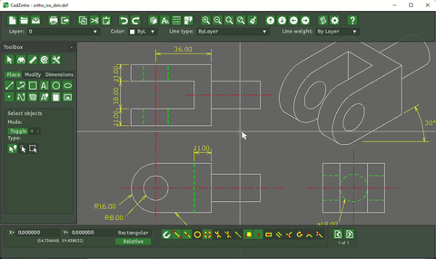

|     |     |
| --- | --- |
|  |  |

## Boas vindas!

Este site pretende ser um ponto de encontro, discussão e aprendizagem para todos os interessados no uso de [software livre](https://www.bimlivre.org/index.php?p=/discussion/11/o-que-e-software-livre) nas áreas de arquitetura, engenharia e afins, para [CAD](https://pt.wikipedia.org/wiki/Desenho_assistido_por_computador) e, sobretudo, [BIM](https://pt.wikipedia.org/wiki/BIM).

Este site está mantido por voluntários interessados no tema, não é patrocinado por nenhuma entidade ou empresa. A ideia é permitir que as pessoas interessadas possam aprender sobre o tema uma com a outra, e promover discussões horizontais, genéricas sobre o tema do BIM, que não estejam atreladas a um software particular. Em outras palavras, uma versão brasileira do [osarch.org](https://community.osarch.org/).

A casa é sua, fique a vontade para participar, acrescentar ideias e conteúdo, ou simplesmente usar este lugar para tirar dúvidas. Todos os arquivos deste site estão livres também e podem ser editados no [Github](https://github.com/yorikvanhavre/BIMLivre). Este site começou como um forum, mas resolvi tornar ele um site estático por cause da baixa participação.

#### Conteúdo

* [Lista de software livre para BIM e CAD](#lista-de-software-livre-para-bim-e-cad)

* [Material sobre o FreeCAD em português](#material-sobre-o-freecad-em-portugues)

* [Material sobre o BlenderBIM em português](#material-sobre-o-blenderbim-em-portugues)

* [Material sobre o BIM em geral em português](#material-sobre-o-bim-em-geral-em-portugues)

* [O que é software livre?](#o-que-e-software-livre)

## Lista de software livre para BIM e CAD

Vou iniciar aqui uma lista de software livre útil na área do BIM. Acrescente as suas descobertas aqui! Veja também aqui uma [lista muito completa](https://wiki.osarch.org/index.php?title=AEC_Free_Software_directory) (em inglês), elaborada por nossos amigos do [osarch.org](https://osarch.org). Todo o software listado abaixo é [software livre](https://www.bimlivre.org/index.php?p=/discussion/11/o-que-e-software-livre), e, salvo menção contrária abaixo, multi-plataforma (Windows, Linux e Mac)

Para discutir softwares específicos, por favor crie uma outra discussão para manter esta lista o mais limpo possível.

### Desenho CAD (2D)

|     |     |
| --- | --- | 
|  | [LibreCAD](https://librecad.org) foi originalmente um *fork* do QCAD, que depois evoluiu e virou um aplicativo bem diferente, mas continua focada no desenho 2D. A versão 3.0 inclui um suporte experimental ao formato DWG.  **Software em português** |
|  | [QCAD](https://qcad.org) é um aplicativo de desenho 2D, com todos os recursos geralmente encontrados em aplicativos CAD tradicionais. A versão de base é open-source e suporta o formato DXF apenas. Existe uma versão paga que acrescenta o suporte ao formato DWG à versão de base.  **Software em português** |
|  | [FreeCAD](https://www.freecad.org/?lang=pt_BR), apesar de ser principalmente um aplicativo para modelagem 3D e BIM, possui também uma extensa bancada de ferramentas para desenho 2D, podendo ser usado como uma plataforma CAD tradicional. Ele importa e exporta para os formatos DXF e DWG (este último usando um conversor externo). **Software em português** + **Site em português** |
|  | [CadZinho](https://github.com/zecruel/CadZinho) é um aplicativo de desenho CAD 2D similar ao LibreCAD. É bastante minimalista e extensível via a linguagem Lua. |

### Modelagem BIM (3D)

|     |     |
| --- | --- | 
|  | [FreeCAD](https://www.freecad.org/?lang=pt_BR) é um modelador 3D paramétrico de código aberto feito principalmente para projetar objetos da vida real de qualquer tamanho. A modelagem paramétrica permite que você modifique facilmente seu design, voltando para o histórico do modelo e alterando seus parâmetros. O FreeCAD é um modelador genérico, mas possui uma bancada específica para BIM com excelente compatibilidade com o formato IFC.  **Software em português** + **Site em português** |
|  | [BlenderBIM](https://blenderbim.org) é um plug-in para o [Blender](https://blender.org), um aplicativo de modelagem 3D conhecido, baseado em malhas. O BlenderBIM traz ferramentas e funcionalidade BIM no Blender, com forte enfoque no formato IFC. O BlenderBIM inclui muitas ferramentas e utilitários para trabalhar com arquivos IFC nativamente. |
|   | [Blender](https://blender.org), mesmo usado sem o plug-in [BlenderBIM](https://blenderbim.org), é uma poderosa plataforma de modelagem 3D. Possuí inclusive outros plug-ins úteis para a modelagem de prédios e outras obras de construção, como o [ArchiPack](https://blender-archipack.org/). Modelos elaborados com o Blender podem ser facilmente usados em âmbito BIM, por exemplo acrescentando informações adicionais neles com o BlenderBIM ou o FreeCAD.  **Software em português** |

### Office

|     |     |
| --- | --- | 
|  | [LibreOffice](https://pt-br.libreoffice.org/) é uma suíte office similar e totalmente compatível com a suíte Office da Microsoft. Possuí módulo de edição de textos, planilha e apresentação compatíveis com os formatos da Microsoft (docx, xlsx, pptx) e uma interface muito fácil.  **Software em português** + **Site em português** |

### GIS

|     |     |
| --- | --- | 
|  | [QGIS](https://qgis.org/pt_BR/site/) é uma plataforma completa para trabalhar com informações geoespaciais. Com o QGIS é possível obter, tratar, converter, produzir dados e mapas em uma interface pr´tica e bem desenvolvida.  **Software em português** + **Site em português** |

### Análise estrutural

|     |     |
| --- | --- | 
|  | [CodeAster](https://www.code-aster.org) oferece uma gama completa de métodos de modelagem e análise multifísica que vão muito além das funções padrão de um código de cálculo termomecânico: de análise sísmica a meios porosos via acústica, fadiga, dinâmica estocástica, etc. |

### Análise energética

|     |     |
| --- | --- | 
|  | [OpenStudio](https://openstudiocoalition.org/) é um aplicativo para fazer análises e simulações de desempenho energético a partir de um modelo BIM. Suporta os formatos IFC e GbXML. É um aplicativo complexo mas poderoso. Internamente, usa o [EnergyPlus](https://energyplus.net/). |

### Edição de arquivos PDF

|     |     |
| --- | --- | 
|  | [LibreOffice Draw](https://pt-br.libreoffice.org/) é o módulo de desenho vetorial do LibreOffice. É uma excelente ferramenta para editar e anotar PDFs. Os textos, especificamente, são geralmente muito bem suportados. **Software em português** + **Site em português** |
|  | [Inkscape](https://inkscape.org/pt-br/?switchlang=pt-br) é um aplicativo de desenho vetorial baseado no formato SVG. Também abre e salva no formato PDF com facilidade e tem ferramentas mais parecidas com softwares CAD, o que permite fazer várias alterações simples em arquivos PDF.  **Software em português** + **Site em português** |

### Visualização de arquivos IFC

|     |     |
| --- | --- | 
|  | [IFC++](http://www.ifcquery.com/) é um  aplicativo simples para Windows e Linux que permite visualizar arquivos IFC e examinar o conteúdo. Não permite editar ou modificar o conteúdo do arquivo, mas é muito rápido e permite rapidamente detetar erros. |
|  | [IfcOpenShell viewer](http://viewer.ifcopenshell.org/) é um componente online (funciona dentro do navegador) do [IfcOpenShell](http://ifcopenshell.org/), que é o software responsável por importar e exporter arquivos IFC usado por ambos o FreeCAD e o BlenderBIM. O viewer permite carregar um arquivo IFC, visualizar a estrutura e o conteúdo, e obter vistas em planta. |
|  | [ifc.js viewer](https://ifcjs.github.io/web-ifc-viewer/example/index) é um visualizador simples construído com a plataforma [ifc.js](https://github.com/agviegas/IFC.js) e que funciona dentro do navegador. A página do projeto explica como construir seu visualizador próprio de maneira muito simples. |

## Material sobre o FreeCAD em português

- [A página principal do FreeCAD em português](https://www.freecadweb.org/?lang=pt_BR)
- [A documentação do FreeCAD em português](https://wiki.freecad.org/Main_Page/pt-br) (somente parte das páginas estão traduzidas)
- [Série de video-tutoriais sobre o FreeCAD do Engenheiro de Plantão](https://www.youtube.com/watch?v=MJTVIavTFzQ&list=PLCQQLujpF4hXTpidBq6Qgy8uN4wIO65uj)
- [Curso de FreeCAD do Sam Velasquez](https://www.youtube.com/playlist?list=PLjDLaRK-1qyipl0Z0H-UcNQR_pBRrILrn)
- [Canal do FreeCAD dicas](https://www.youtube.com/channel/UCIRWNsUAzq4FU8zUH3UX-kQ/videos)
- [Seção em português do forum do FreeCAD](https://forum.freecad.org/viewforum.php?f=32)
- [Tutoriais sobre FreeCAD & BIM do HR Compacta](https://www.youtube.com/playlist?list=PLcr32YYn5HL11neg4Mxxm35ZNkZnyITZw)
- [Curso do Allan Brito: FreeCAD para desenho arquitetônico](https://eadallanbrito.com/curso/curso-de-freecad-para-desenho-arquitetonico/) (pago)
- [Curso de BIM com o FreeCAD do Solare](https://solare.org.br/2022/10/31/curso-de-bim-com-freecad/)
- [Curso de BIM do Projetos e Afins](https://www.youtube.com/watch?v=CsFcGXNA-E4&list=PLVUg9T2GboD7eWnNf2UZpZjExrKtCon-4)

## Material sobre o BlenderBIM em português

- [Vídeo "Conhecendo o BlenderBIM"](https://www.youtube.com/watch?v=AH4o5CzBV5Y)
- [Vídeo "Como instalar o BlenderBIM"](https://www.youtube.com/watch?v=VmEkPZwsqpg)
- [Videos do Carlos Dias](https://youtu.be/bJJpW5FqcB0)

## Material sobre o BIM em geral em português

* [Cursos (gratuitos) de introdução ao BIM em "Democratizando BIM"](https://eadbim.abdi.com.br/)

* [Cursos do Solare](https://solare.org.br/) - Blog e cursos gratuitos sobre vários softwares livres para arquitetura e engenharia

## O que é software livre?

O termo [software livre](https://pt.wikipedia.org/wiki/Software_livre) designa programas de computadores que possuem uma licença livre.

Software livre é geralmente gratuito também, mas a gratuidade é somente uma parte da liberdade oferecida pela licença. Licenças de software livre são fundamentalmente desenhadas para garantir liberdades ao usuário, e garantir que essas liberdades não possam ser removidas. Ali está a grande diferença com software comercial gratuito, que pode deixar de ser gratuito a qualquer momento.

A licença livre mais conhecido é provavelmente a licença [GPL](https://pt.wikipedia.org/wiki/GNU_General_Public_License), mas tem várias outras como a [LGPL](https://pt.wikipedia.org/wiki/GNU_LGPL), [MIT](https://pt.wikipedia.org/wiki/Licen%C3%A7a_MIT) ou [BSD](https://pt.wikipedia.org/wiki/Licen%C3%A7a_BSD). Algumas são mais restritivas, outras mais permissivas, mas essas diferenças valem sobretudo para quem quer usar parte do [código fonte](https://pt.wikipedia.org/wiki/C%C3%B3digo_fonte) em outro software. Para o usuário, são todas quase idênticas.

Todas essas licenças oferecem 4 liberdades fundamentais:

1. A liberdade de **usar o software incondicionalmente**, como quiser, quando quiser. Não existem cláusulas restringindo o uso a tal ou tal categoria de usuário, ou condicionando funcionalidade específica a um pagamento, um registro do usuário, ou coisas parecidas.
2. A liberdade de **estudar o código fonte**. O código fonte (*source code*, em inglês), deve ser aberto e público, o que gerou o termo "código aberto" (*open-source* em inglês). Vale notar que um software open-source apenas contempla este ponto, e não diz nada sobre os 3 outros. Por isso, preferimos sempre usar o termo "software livre", que é bem mais abrangente que "software open-source". É perfeitamente possível existir software open-source, mas que seja comercial e com restrições de uso. Poder estudar o código fonte pode parecer desnecessário quando se quer somente usar o software, mas isso permite garantir por exemplo que o software não colete seus dados, ou não faça outro tipo de manipulação indesejada por baixo do pano. Em outras palavras, o software é auditável.
3. A liberdade de **redistribuir o software**. Você, legalmente, possuí o direito de distribuir o software (não diz nada sobre cobrar por isso, por tanto a gratuidade não é algo garantido pela licença. No entanto, condicionar o uso a um pagamento ia ferir o ponto 1, por tanto é extremamente raro). Isto permite que você possa instalar o software quantas vezes precisar, distribuir ele para seus clientes para
   que eles possam abrir seus arquivos, e, de maneira geral, melhorar e suavizar problemas de compatibilidade em vez de criá-los.
4. A liberdade de **modificar o software**, e de publicar suas modificações. Dependendo do tipo de licença, suas modificações devem ou não adotar a mesma licença que o software original. Este ponto é muito importante para dinamizar o ecossistema em torno do software, e permitir o maior número possível de contribuições ao seu desenvolvimento. Software livre é por essência desenvolvida de forma colaborativa, por qualquer pessoa interessada em contribuir.

Diferentemente de software comercial, software livre não é desenvolvido para gerar lucro, ou com qualquer outro intuito comercial. Software livre é geralmente desenvolvido primeiramente por usuários, para seu próprio uso. Certos projetos, quando ficam maiores, passam a ter estrutura maior, receber doações, contratar programadores e organizar outras coisas para acelerar o desenvolvimento. Todos esses softwares, no entanto, são sempre abertos a contribuições de qualquer 
tipo, como código, doações, ou qualquer outro tipo de ajuda, como escrever documentação, traduzir, etc.
